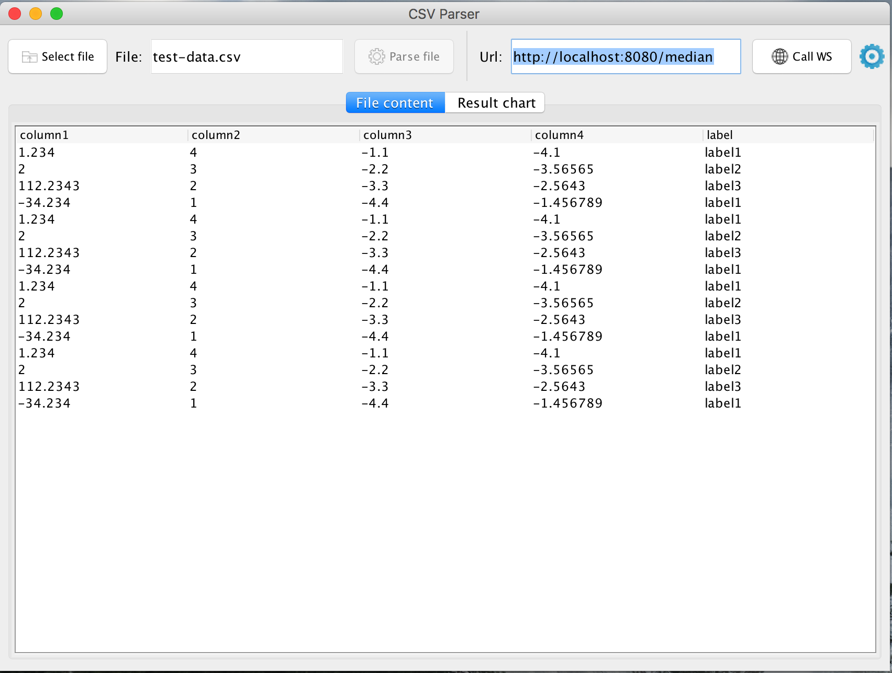

# Java Swing Generic CSV Parser

Standalone java application which is able to parse the provided CSV files, sends the parsed data to a Web service and saves the result in a new file

[](doc/csvparser-main.png)

### Build

```shell
./gradlew  shadowJar 
```

### Run

```shell
java -jar build/libs/csvparser-0.1-all.jar
```

or simple double click on jar file


### How it works

1. Click on 'Select file' button
2. Select a CSV file with ';' delimiter
3. Click on 'Parse file' button, now your file is displayed in the table
4. Set the 'Url' address to 'wsmedian' service, or keep it's default value 
5. Click on 'Call WS'

_The **icon** from the right side indicates the **action status**_

Now, you can find newly created file in the application folder, named: 'WSMedianResponse.csv' 

##
